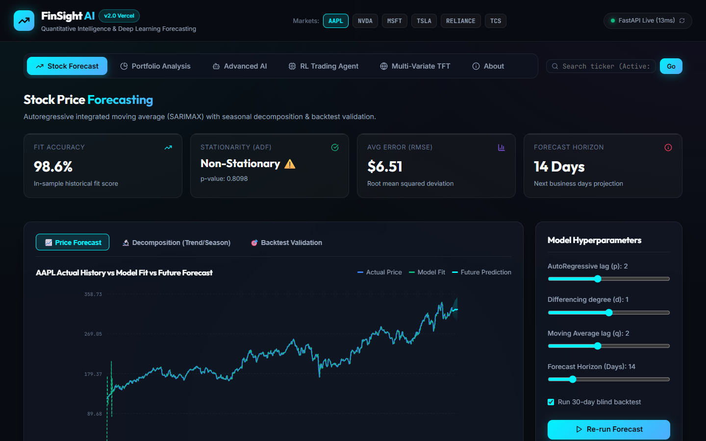
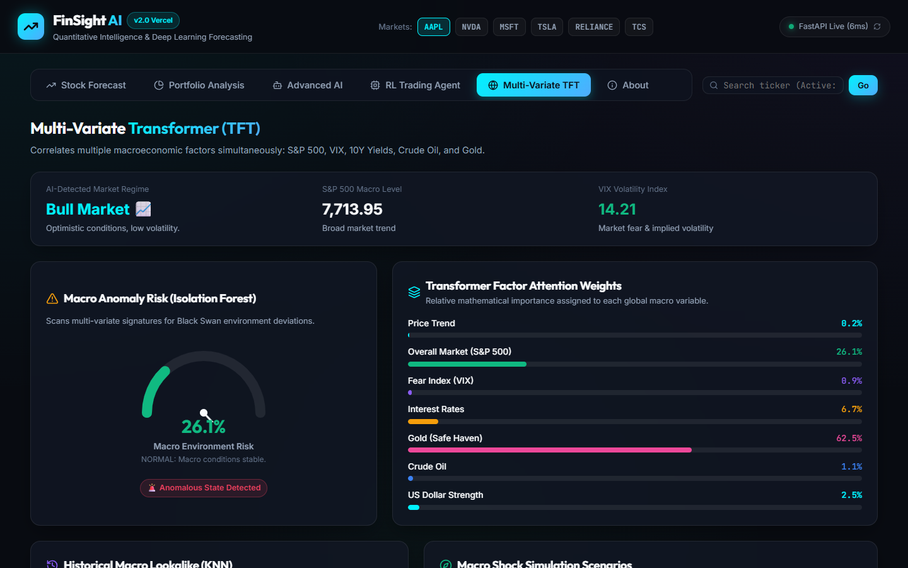
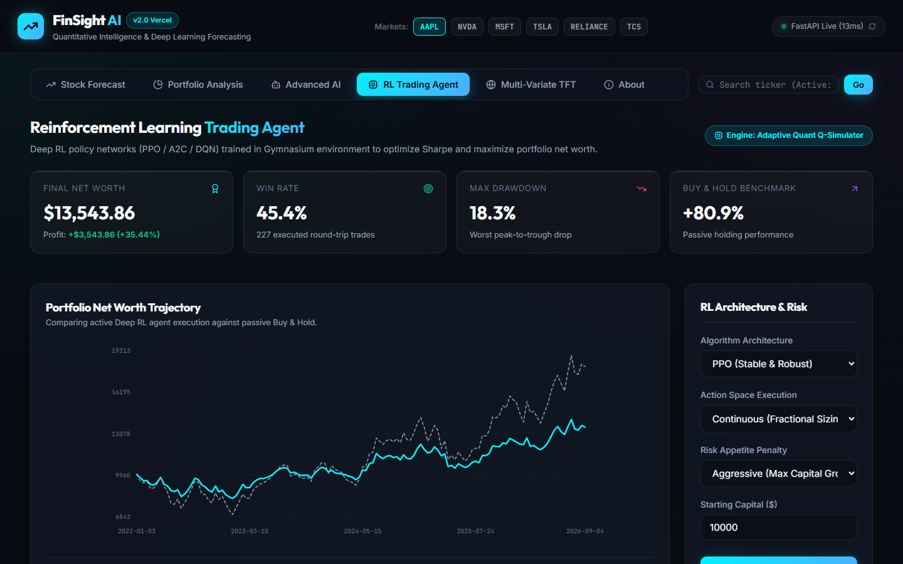
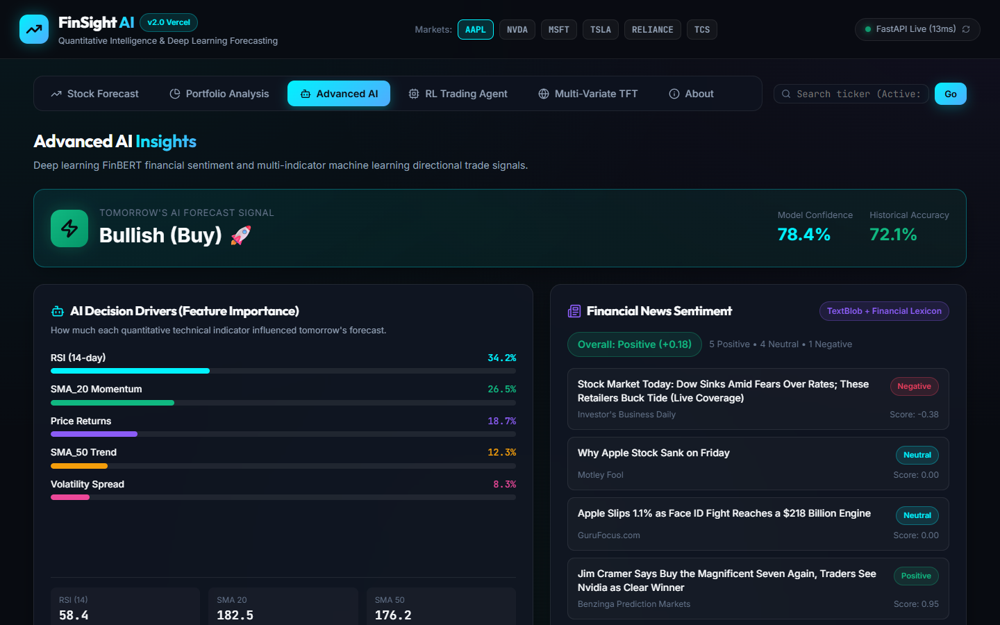
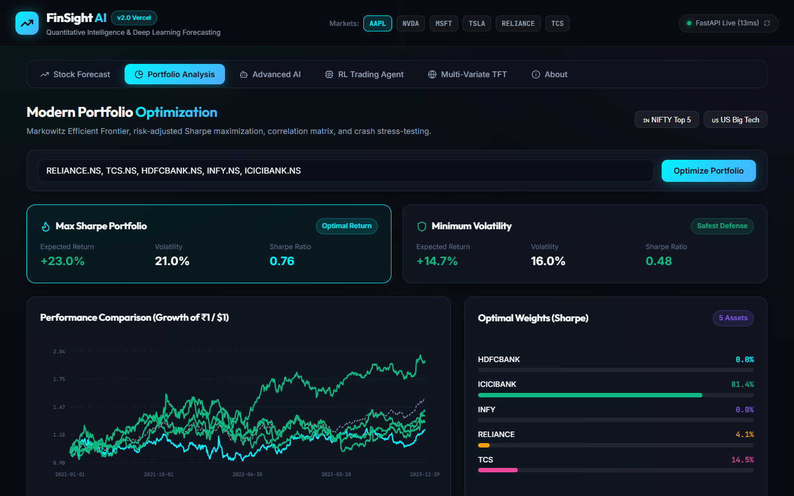
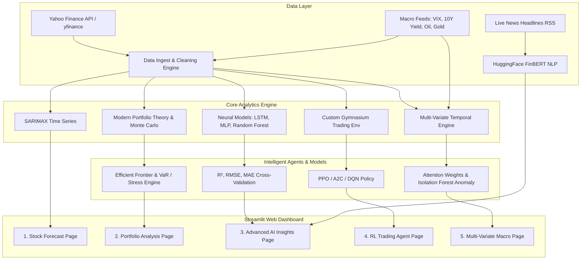

# 📈 FinSight AI — Next-Gen Financial Intelligence & Algorithmic Trading Platform

<p align="center">
  
  
  
  
  
  
</p>

<p align="center">
  <strong>FinSight AI</strong> is an end-to-end quantitative finance and artificial intelligence platform that unifies <strong>statistical forecasting (SARIMAX)</strong>, <strong>Modern Portfolio Theory (MPT)</strong>, <strong>Deep Learning (LSTM, MLP, FinBERT Transformers)</strong>, <strong>Reinforcement Learning Trading Agents (PPO, A2C, DQN)</strong>, and <strong>Multi-Variate Macro Temporal Intelligence</strong> into a responsive, production-ready dashboard.
</p>

<p align="center">
  <a href="#-key-modules--features">Key Features</a> •
  <a href="#-system-architecture">Architecture</a> •
  <a href="#-interactive-previews">Interactive Previews</a> •
  <a href="#-quick-start">Quick Start</a> •
  <a href="#-project-structure">Project Structure</a> •
  <a href="#-mathematical-foundations">Math Foundations</a> •
  <a href="#-author">Author</a>
</p>

---

## 🌟 Highlights

- 🔮 **Hybrid Forecasting Engine:** Combines classical econometrics (SARIMAX with ADF testing & seasonal decomposition) with deep learning architectures (LSTM & MLP).
- 📰 **Financial NLP with FinBERT:** Transformer-based domain-specific sentiment analysis on live financial headlines with automatic neutral/bullish/bearish scoring.
- 💼 **Institutional Portfolio Optimization:** Markowitz Efficient Frontier generation via Monte Carlo simulations (1000+ portfolios), Max Sharpe & Min Volatility allocations, historical crash stress-testing, and parametric/historical Value at Risk (VaR & CVaR).
- 🤖 **Deep Reinforcement Learning Trading:** Custom OpenAI `Gymnasium` stock trading environment supporting PPO, A2C, and DQN agents with continuous fractional position sizing and risk-adjusted reward penalties.
- 🌐 **Multi-Variate Macro Regime & Explainable AI:** Cross-asset attention weighting (S&P 500, VIX, 10Y Yields, Gold, Crude Oil, DXY), Isolation Forest anomaly/Black Swan detection, and KNN historical lookalike matching.

---

## 📸 Interactive Previews

<div align="center">

| Module | Interface Preview |
| :--- | :--- |
| **Statistical Forecast (SARIMAX)** |  |
| **Portfolio Optimizer & Efficient Frontier** |  |
| **Deep Learning & Model Comparison** |  |
| **Advanced AI Insights & Sentiment** |  |
| **Asset Allocation & Risk Analysis** |  |

</div>

---

## 📦 Key Modules & Features

### 1️⃣ Stock Forecasting Engine (`views/forecast_page.py`)
- **Live Data Ingestion:** Real-time historical OHLCV data fetched via Yahoo Finance API (`yfinance`).
- **Stationarity & Statistical Tests:** Augmented Dickey-Fuller (ADF) test for stationarity verification and differencing order determination.
- **Seasonal Decomposition:** Isolates price dynamics into **Trend**, **Seasonality**, and **Residual Noise** components.
- **Configurable SARIMAX:** User-controlled $(p, d, q) \times (P, D, Q)_s$ hyperparameter grid.
- **Rigorous Backtesting:** Split-sample backtesting against holdout sets with automated **RMSE**, **MAPE**, and confidence interval bands.

---

### 2️⃣ Modern Portfolio Theory & Risk Engine (`views/portfolio_page.py`)
- **Markowitz Optimization:** Mathematical portfolio frontier construction optimizing risk-adjusted returns (Sharpe Ratio).
- **Monte Carlo Simulations:** 1,000+ randomized weight iterations plotting the full risk-return spectrum.
- **Sector Diversification:** Support for custom equity baskets with sector-level weighting and correlation heatmaps.
- **Tail-Risk Analysis:**
  - Parametric & Historical **Value at Risk (VaR @ 95% & 99%)**
  - **Conditional Value at Risk (CVaR / Expected Shortfall)**
  - **Portfolio Beta ($\beta$)** vs benchmark index (`^NSEI` / `^GSPC`)
  - **Maximum Historical Drawdown (MDD)**
- **Historical Stress Testing:** Simulates portfolio shocks against major historical crashes (2020 COVID-19 Crash, 2008 Global Financial Crisis, 2000 Dot-com Bubble, Moderate & Severe Market Corrections).

---

### 3️⃣ Advanced AI & Deep Learning Suite (`views/ai_page.py`)
- **FinBERT Sentiment Analysis:** Pretrained HuggingFace `ProsusAI/finbert` Transformer extracting contextual sentiment polarities from live news feeds.
- **Directional Trend Classification:** Ensemble `RandomForestClassifier` predicting next-day directional momentum using RSI (14-day), SMA_20, SMA_50, and percentage volatility.
- **Multi-Layer Perceptron (MLP):** 2-layer dense network with ReLU activations and L2 weight regularization for sequence mapping.
- **Long Short-Term Memory (LSTM):** 2-layer Recurrent Neural Network with Dropout (0.2) and Early Stopping to capture temporal dependencies (with automated Gradient Boosting fallback).
- **Head-to-Head Benchmark Table:** Side-by-side $R^2$, RMSE, and MAE evaluations across classical, machine learning, and deep learning models.

---

### 4️⃣ Reinforcement Learning Algorithmic Trader (`views/rl_page.py`)
- **Custom Gymnasium Environment (`StockTradingEnv`):** Real-world simulated trading environment with 9-dimensional state space (normalized cash, shares, price ratios, 1-day & 5-day returns, RSI, MACD, and Bollinger Band position).
- **Multiple Policy Algorithms:**
  - **PPO** (Proximal Policy Optimization)
  - **A2C** (Advantage Actor-Critic)
  - **DQN** (Deep Q-Network)
- **Continuous & Discrete Actions:** Supports both discrete signals (*Hold / Buy Max / Sell All*) and continuous fractional position sizing ($-1.0 \le \alpha \le 1.0$).
- **Risk-Adjusted Reward Engine:** Penalizes excessive portfolio drawdowns in *Conservative* mode and rewards sustained alpha in *Aggressive* mode.
- **Real-Time Strategy Benchmarking:** Evaluates learned policy against traditional *Buy & Hold* benchmark over entire historical window.

---

### 5️⃣ Multi-Variate Temporal Fusion & Macro Intelligence (`views/tft_page.py`)
- **Cross-Asset Macro Fetcher:** Synchronously captures multi-market indicators:
  - Equity Benchmark (S&P 500 `^GSPC`)
  - Market Volatility / Fear Index (VIX `^VIX`)
  - US 10-Year Treasury Yield (`^TNX`)
  - Safe-Haven Commodities (Gold `GLD`, Crude Oil `USO`, US Dollar Index `DX-Y.NYB`)
- **Explainable Multi-Head Attention:** Quantifies and visualizes the exact impact weight of each macro factor on price action.
- **Black Swan Anomaly Detection:** `IsolationForest` unsupervised model scanning multivariate macro states for extreme risk events.
- **KNN Historical Lookalike Engine:** Identifies the closest historical day matching today's complex macro signature and projects the 30-day forward outcome.
- **Interactive Macro Shock Simulator:** Adjust interest rates, VIX spikes, and oil price swings to simulate real-time asset sensitivity.

---

## 🏗️ System Architecture



---

## 🧮 Mathematical Foundations

| Metric / Formula | Mathematical Equation | Description |
| :--- | :--- | :--- |
| **Sharpe Ratio** | $\text{Sharpe} = \frac{R_p - R_f}{\sigma_p}$ | Risk-adjusted return excess over risk-free rate ($R_f = 7\%$) |
| **Portfolio Volatility** | $\sigma_p = \sqrt{\mathbf{w}^T \mathbf{\Sigma} \mathbf{w}}$ | Portfolio variance derived from covariance matrix $\mathbf{\Sigma}$ and weights $\mathbf{w}$ |
| **Portfolio Beta** | $\beta_p = \frac{\text{Cov}(R_p, R_m)}{\text{Var}(R_m)}$ | Sensitivity of portfolio returns to market benchmark returns |
| **Value at Risk (VaR)** | $\text{VaR}_\alpha = -\text{Percentile}(R_p, 1-\alpha)$ | Maximum expected loss at confidence level $\alpha \in \{95\%, 99\%\}$ |
| **LSTM Cell State** | $c_t = f_t \odot c_{t-1} + i_t \odot \tilde{c}_t$ | Long-term memory propagation controlled by forget ($f_t$) and input ($i_t$) gates |
| **Root Mean Squared Error** | $\text{RMSE} = \sqrt{\frac{1}{N}\sum_{t=1}^N (y_t - \hat{y}_t)^2}$ | Standard deviation of prediction residuals |
| **Mean Absolute Percentage Error** | $\text{MAPE} = \frac{100\%}{N}\sum_{t=1}^N \left\|\frac{y_t - \hat{y}_t}{y_t}\right\|$ | Normalized percentage forecasting error |

---

## 🛠️ Tech Stack & Dependencies

| Category | Technologies / Libraries |
| :--- | :--- |
| **Frontend UI** | Streamlit, Plotly, Seaborn, Matplotlib, HTML5/CSS3 |
| **Data & Financial APIs** | yfinance, Pandas, NumPy, Scipy, PyArrow |
| **Time Series & Statistics** | Statsmodels (SARIMAX, ADF Test, Seasonal Decompose) |
| **Machine Learning** | Scikit-Learn (Random Forest, Isolation Forest, GradientBoosting, NearestNeighbors, MLP) |
| **Deep Learning** | PyTorch, Hugging Face Transformers (`ProsusAI/finbert`) |
| **Reinforcement Learning** | Gymnasium, Stable-Baselines3 (PPO, A2C, DQN) |
| **Language Processing** | TextBlob, HuggingFace Tokenizers |

---

## 🚀 Quick Start Guide

### Prerequisites
- Python 3.10 or Python 3.11 installed
- Git installed

### 1. Clone the Repository
```bash
git clone https://github.com/Dwij2710/FinSight-AI.git
cd FinSight-AI
```

### 2. Create and Activate a Virtual Environment
```bash
# Windows
python -m venv venv
venv\Scripts\activate

# Linux / macOS
python3 -m venv venv
source venv/bin/activate
```

### 3. Install Dependencies
```bash
pip install --upgrade pip
pip install -r requirements.txt
```

### 4. Run the Streamlit Application
```bash
streamlit run app.py
```
> The dashboard will automatically open in your default browser at `http://localhost:8501`.

---

## 📁 Project Structure

```text
FinSight-AI/
├── .streamlit/                 # Streamlit theme and server configuration
├── assets/                     # UI screenshots and visual diagrams
│   ├── ai_insights.png
│   ├── efficient_frontier.png
│   ├── forecast.png
│   ├── model_comparison.png
│   └── portfolio_optimization.png
├── config/                     # Central configuration constants & tickers
│   ├── __init__.py
│   └── config.py               # Stock baskets, benchmark tickers, stress scenarios
├── src/                        # Core algorithms and business logic
│   ├── __init__.py
│   ├── ai_features.py          # MLP, LSTM, FinBERT, and Trend Classifiers
│   ├── correlation_analysis.py # Return correlations and covariance structures
│   ├── data_fetcher.py         # Yahoo Finance data pipeline & caching
│   ├── portfolio_optimizer.py  # Markowitz MPT & Monte Carlo simulator
│   ├── returns_analysis.py     # Cumulative returns, alpha, and drawdowns
│   ├── risk_metrics.py         # VaR, CVaR, Sharpe, and Beta calculations
│   ├── rl_agent.py             # Custom Gymnasium trading env & RL algorithms
│   ├── stress_testing.py       # Historical crisis simulation engine
│   └── tft_features.py         # Multi-variate macro integration & Isolation Forest
├── views/                      # Streamlit UI page views
│   ├── __init__.py
│   ├── ai_page.py              # Advanced AI & FinBERT Sentiment UI
│   ├── forecast_page.py        # SARIMAX Forecasting UI
│   ├── portfolio_page.py       # Portfolio Optimizer & Risk Engine UI
│   ├── rl_page.py              # RL Trading Agent Simulator UI
│   └── tft_page.py             # Multi-Variate Macro Regime UI
├── app.py                      # Main Streamlit application entry point
├── run_app.py                  # Standalone CLI runner script
├── requirements.txt            # Project dependencies
├── PROJECT_WORKFLOW.md         # Comprehensive viva/exam guide & architecture doc
├── ARCHITECTURE_DIAGRAMS.html  # Interactive architecture diagrams
└── README.md                   # Project documentation
```

---

## 🔮 Future Roadmap

- [ ] **Multi-Stock Simultaneous Transformer Attention (Full TFT)** for multi-entity cross-learning.
- [ ] **Live Webhook & Broker Integration** (Zerodha Kite / Alpaca Paper Trading API).
- [ ] **Macro-Economic FRED API Integration** for real-time inflation, CPI, and GDP indicators.
- [ ] **LLM Financial Agent (RAG)** integrating financial earnings call transcripts with vector search.

---

## 👨‍💻 Author

**Dwij Prajapati**  
- GitHub: [@Dwij2710](https://github.com/Dwij2710)
- Project Repository: [FinSight-AI](https://github.com/Dwij2710/FinSight-AI)

---

## ⚠️ Disclaimer

*This application is developed strictly for **academic, research, and educational purposes**. Stock market investments are subject to market risks. The forecasts, models, sentiment scores, and algorithmic strategies generated by FinSight AI should **NOT** be treated as financial advice or used for live capital allocation without independent professional verification.*

---

<p align="center">
  <sub>Built with ❤️ using Python, PyTorch, Streamlit & Stable-Baselines3. If you find this project helpful, please consider giving it a ⭐!</sub>
</p>