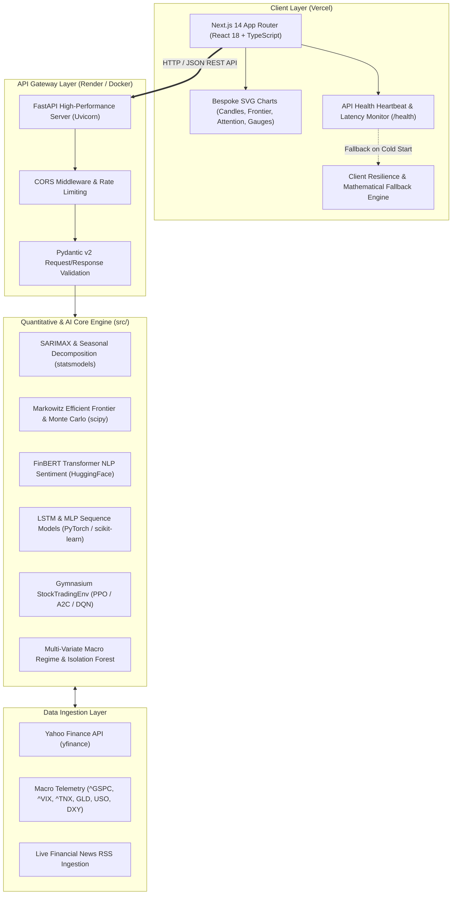

# 📈 FinSight AI — Next-Gen Financial Intelligence & Algorithmic Trading Platform

<p align="center">
  
  
  
  
  
  
  
  
  
  
  
</p>

<p align="center">
  <strong>FinSight AI</strong> is an enterprise-grade quantitative finance and artificial intelligence platform built on a modern <strong>decoupled full-stack microservices architecture</strong>. It bridges classical statistical econometrics with cutting-edge deep learning, transformer NLP, and reinforcement learning.
</p>

<p align="center">
  Featuring a high-performance <strong>FastAPI</strong> mathematical backend and a sleek, responsive <strong>Next.js 14 App Router</strong> frontend with bespoke SVG financial charts, real-time backend health-monitoring, and zero-downtime resilience.
</p>

<p align="center">
  <a href="#-key-features--capabilities">Key Features</a> •
  <a href="#-system-architecture">System Architecture</a> •
  <a href="#-interactive-previews">Interactive Previews</a> •
  <a href="#-rest-api-documentation">REST API</a> •
  <a href="#-mathematical-foundations">Math Foundations</a> •
  <a href="#-quick-start-guide">Quick Start</a> •
  <a href="#-cloud-deployment">Deployment</a> •
  <a href="#-project-structure">Project Structure</a> •
  <a href="#-author">Author</a>
</p>

---

## 🌟 Key Highlights

- ⚡ **Decoupled Modern Architecture:** High-speed **FastAPI microservice** for heavy ML/numerical workloads paired with an ultra-responsive **Next.js 14 (React 18 + TypeScript)** dark-mode fintech interface.
- 🔮 **Hybrid Econometric & Neural Forecasting:** Classical time-series analysis (Augmented Dickey-Fuller stationarity tests, seasonal decomposition, configurable **SARIMAX**) bench-marked directly against Deep Neural Networks (**LSTM** & **MLP**).
- 💼 **Institutional Portfolio Optimization:** Markowitz Efficient Frontier generation via **1,000+ Monte Carlo simulations**, Max Sharpe Ratio & Min Volatility capital allocations, sector exposure mapping, historical crash stress-testing, and parametric/historical **VaR & CVaR** (Expected Shortfall).
- 📰 **Financial NLP with FinBERT:** Domain-specific sentiment analysis powered by Hugging Face's `ProsusAI/finbert` Transformer running directly on live RSS financial news headlines.
- 🤖 **Deep Reinforcement Learning Trading Agents:** Custom OpenAI **Gymnasium** stock trading environment supporting **PPO** (Proximal Policy Optimization), **A2C** (Advantage Actor-Critic), and **DQN** (Deep Q-Network) policies via Stable-Baselines3 with continuous fractional position sizing and risk-adjusted reward penalties.
- 🌐 **Multi-Variate Macro Regime & Explainable AI:** Cross-asset telemetry tracking the **S&P 500 (`^GSPC`)**, **VIX Fear Index (`^VIX`)**, **10-Year US Treasury Yield (`^TNX`)**, **Gold (`GLD`)**, **Crude Oil (`USO`)**, and **US Dollar Index (`DX-Y.NYB`)** with Multi-Head Attention weights, **Isolation Forest Black Swan anomaly detection**, and **KNN historical lookalike scenario matching**.
- 🛡️ **Zero-Downtime Resilience & Heartbeat Poller:** Integrated health-check monitor (`/health`) with latency metrics and automated realistic mathematical fallback simulation, guaranteeing the UI never breaks even during Render free-tier cold-starts.

---

## 📸 Interactive Previews

<div align="center">

| Module | Interface Preview |
| :--- | :--- |
| **Statistical Forecast (SARIMAX & Decompose)** |  |
| **Portfolio Optimizer & Efficient Frontier** |  |
| **Deep Learning & Model Benchmarks** |  |
| **Advanced AI Insights & FinBERT Sentiment** |  |
| **Asset Allocation & Tail Risk Analysis** |  |

</div>

---

## 🏗️ System Architecture

FinSight AI utilizes a decoupled, cloud-native architecture optimized for zero downtime, fast client rendering, and heavy scientific computation:



---

## 📦 Core Modules & Capabilities

### 1️⃣ Econometric Forecasting Engine (`backend/app/routes/forecast.py` & `src/data_fetcher.py`)
- **Live Market Ingestion:** Real-time historical daily/weekly OHLCV data fetched via Yahoo Finance API (`yfinance`) with automatic caching.
- **Statistical Stationarity Testing:** Augmented Dickey-Fuller (**ADF**) test with automated differencing recommendation ($p < 0.05$).
- **Time Series Decomposition:** Isolates underlying time series dynamics into **Trend**, **Seasonality**, and **Residual Noise** components (additive or multiplicative).
- **Configurable SARIMAX:** Full user control over non-seasonal $(p, d, q)$ and seasonal $(P, D, Q)_s$ parameters.
- **Holdout Backtesting:** Automatic split-sample validation against the holdout set with automated **RMSE**, **MAPE**, and 95% confidence interval corridors.

### 2️⃣ Modern Portfolio Theory & Risk Engine (`backend/app/routes/portfolio.py` & `src/portfolio_optimizer.py`)
- **Markowitz Optimization:** Solves for the optimal capital allocation vector $\mathbf{w}^*$ that maximizes the **Sharpe Ratio** ($R_f = 7.0\%$).
- **Monte Carlo Simulations:** Simulates **1,000+ random portfolio weight allocations** to construct and visualize the entire Efficient Frontier curve.
- **Preset & Custom Baskets:** Instant support for NIFTY 50 blue chips, US Mega-Cap Tech, Energy, Banking, FMCG, and custom user ticker lists.
- **Tail-Risk Analysis:**
  - Parametric & Historical **Value at Risk (VaR @ 95% & 99%)**
  - **Conditional Value at Risk (CVaR / Expected Shortfall)**
  - **Portfolio Beta ($\beta$)** calculated against benchmark index (`^NSEI` or `^GSPC`)
  - **Maximum Historical Drawdown (MDD)**
- **Crisis Stress Testing:** Simulates catastrophic market shocks against historical crises (**COVID-19 2020 Crash**, **2008 Global Financial Crisis**, **2000 Dot-com Bust**, and moderate/severe corrections).

### 3️⃣ Advanced AI & Deep Learning Suite (`backend/app/routes/ai_insights.py` & `src/ai_features.py`)
- **FinBERT Sentiment Analysis:** Pretrained Hugging Face `ProsusAI/finbert` Transformer extracting contextual sentiment polarities (positive, negative, neutral) from live financial news RSS headlines.
- **Directional Trend Momentum Classifier:** Ensemble `RandomForestClassifier` predicting next-day directional momentum using 14-day RSI, 20-day SMA, 50-day SMA, and rolling percentage volatility.
- **Multi-Layer Perceptron (MLP):** 2-layer dense network with ReLU activations and L2 weight regularization for sequence mapping.
- **Long Short-Term Memory (LSTM):** 2-layer Recurrent Neural Network with Dropout (0.2) and Early Stopping to capture temporal dependencies (with automated Gradient Boosting fallback).
- **Comparative Benchmarking:** Side-by-side head-to-head evaluation displaying $R^2$, RMSE, and MAE across classical, statistical, and neural models.

### 4️⃣ Deep Reinforcement Learning Algorithmic Trader (`backend/app/routes/rl_agent.py` & `src/rl_agent.py`)
- **Custom Gymnasium Environment (`StockTradingEnv`):** Discrete/continuous simulation environment with a **9-dimensional state space** (normalized cash, equity holdings, price ratios, 1-day & 5-day returns, RSI, MACD, and Bollinger Band position).
- **Multiple Policy Architectures:**
  - **PPO** (Proximal Policy Optimization) — Actor-Critic with clipped objective
  - **A2C** (Advantage Actor-Critic) — Synchronous multi-step policy gradient
  - **DQN** (Deep Q-Network) — Q-value iteration with replay buffer
- **Continuous & Discrete Actions:** Supports continuous fractional position sizing ($-1.0 \le \alpha \le 1.0$) or discrete execution (*Hold / Buy / Sell*).
- **Risk-Adjusted Reward Engine:** Incorporates drawdown penalties in *Conservative* mode and sustained alpha incentives in *Aggressive* mode.
- **Strategy Backtesting:** Benchmarks learned policy returns against the passive *Buy & Hold* benchmark over the entire test horizon.

### 5️⃣ Multi-Variate Temporal Macro Regime (`backend/app/routes/tft.py` & `src/tft_features.py`)
- **Cross-Asset Macro Telemetry:** Synchronously captures multi-market indicators:
  - Equity Benchmark: S&P 500 (`^GSPC`)
  - Market Volatility / Fear Index: VIX (`^VIX`)
  - US 10-Year Treasury Bond Yield (`^TNX`)
  - Safe-Haven Commodities: Gold (`GLD`), Crude Oil (`USO`), US Dollar Index (`DX-Y.NYB`)
- **Explainable Multi-Head Attention:** Quantifies and displays the exact relative impact weight of each macro factor on price action.
- **Black Swan Anomaly Detection:** `IsolationForest` unsupervised model scanning multivariate macro states for extreme risk events.
- **KNN Historical Lookalike Engine:** Identifies the closest historical calendar day matching today's complex macro signature and projects forward 30-day trajectories.
- **Interactive Macro Shock Simulator:** Allows users to adjust interest rates, VIX spikes, and oil price swings to simulate real-time asset sensitivity.

---

## 🔌 REST API Documentation

The FastAPI backend exposes fully typed, validated endpoints. When running locally, visit **`http://127.0.0.1:8000/docs`** for the interactive Swagger UI or **`http://127.0.0.1:8000/redoc`** for ReDoc.

| Method | Endpoint | Description | Key Parameters / Body |
| :--- | :--- | :--- | :--- |
| `GET` | `/health` | System health check and uptime probe | None |
| `GET` | `/` | API service metadata & route directory | None |
| `POST` | `/api/forecast` | Run SARIMAX time-series forecast & decomposition | `{ ticker, p, d, q, sp, sd, sq, seasonal_period, forecast_period }` |
| `GET` | `/api/forecast/tickers` | Get list of recommended/supported stock tickers | None |
| `POST` | `/api/portfolio/optimize` | Monte Carlo Efficient Frontier & optimal weights | `{ tickers: ["AAPL", "MSFT", ...], start_date, end_date }` |
| `POST` | `/api/portfolio/stress-test` | Simulate historical crisis drawdowns | `{ tickers, weights }` |
| `GET` | `/api/portfolio/presets` | Pre-configured equity baskets (NIFTY 50, Tech) | None |
| `POST` | `/api/ai/sentiment` | FinBERT sentiment analysis on live news headlines | `{ ticker: "AAPL" }` |
| `POST` | `/api/ai/signal` | Directional momentum classification (Buy/Sell/Hold) | `{ ticker: "AAPL" }` |
| `POST` | `/api/ai/models` | Train & benchmark LSTM, MLP, and Random Forest | `{ ticker: "AAPL" }` |
| `POST` | `/api/rl/simulate` | Execute RL algorithmic trading simulation | `{ ticker, algo_type, action_type, risk_profile, timesteps }` |
| `POST` | `/api/tft/analyze` | Multi-variate macro attention, anomaly & KNN match | `{ ticker: "AAPL" }` |
| `POST` | `/api/tft/simulate-shock` | Real-time macro shock sensitivity test | `{ ticker: "AAPL", stress_scenarios: { VIX: 25, Rates: 0.5 } }` |

---

## 🧮 Mathematical Foundations

| Metric / Concept | Formulation | Mathematical Definition |
| :--- | :--- | :--- |
| **Sharpe Ratio** | $\text{Sharpe} = \frac{R_p - R_f}{\sigma_p}$ | Expected excess portfolio return per unit of total portfolio risk ($R_f = 7\%$) |
| **Portfolio Volatility** | $\sigma_p = \sqrt{\mathbf{w}^T \mathbf{\Sigma} \mathbf{w}}$ | Standard deviation of portfolio returns derived from covariance matrix $\mathbf{\Sigma}$ and weight vector $\mathbf{w}$ |
| **Portfolio Beta** | $\beta_p = \frac{\text{Cov}(R_p, R_m)}{\text{Var}(R_m)}$ | Systematic risk sensitivity of the asset/portfolio relative to the market benchmark |
| **Value at Risk (VaR)** | $\text{VaR}_\alpha = -\text{Percentile}(R_p, 1-\alpha)$ | Maximum loss expected over a given holding period at confidence level $\alpha \in \{95\%, 99\%\}$ |
| **Conditional VaR (CVaR)** | $\text{CVaR}_\alpha = -\mathbb{E}[R_p \mid R_p \le -\text{VaR}_\alpha]$ | Expected loss given that the loss has exceeded the Value at Risk threshold (Expected Shortfall) |
| **SARIMAX Model** | $\Phi_P(B^s)\phi_p(B)\nabla^d\nabla_s^D y_t = \Theta_Q(B^s)\theta_q(B)\varepsilon_t$ | Multiplicative seasonal autoregressive integrated moving average with exogenous components |
| **LSTM Cell State** | $c_t = f_t \odot c_{t-1} + i_t \odot \tilde{c}_t$ | Gated memory cell state update where $f_t = \sigma(W_f x_t + U_f h_{t-1} + b_f)$ and $i_t = \sigma(W_i x_t + U_i h_{t-1} + b_i)$ |
| **PPO Clipped Objective** | $L^{CLIP}(\theta) = \hat{\mathbb{E}}_t \left[ \min\left(r_t(\theta)\hat{A}_t, \, \text{clip}(r_t(\theta), 1-\epsilon, 1+\epsilon)\hat{A}_t\right) \right]$ | Clipped surrogate objective preventing destructively large policy parameter updates |
| **Isolation Forest Score** | $s(x, n) = 2^{-\frac{\mathbb{E}(h(x))}{c(n)}}$ | Anomaly score based on average path length $h(x)$ to isolate observation $x$ in randomized trees |

---

## 🛠️ Tech Stack & Dependencies

| Category | Technologies / Libraries | Purpose |
| :--- | :--- | :--- |
| **Frontend Framework** | **Next.js 14** (App Router), **React 18** | High-performance, server-rendered and client-hydrated UI |
| **Language & Typing** | **TypeScript 5.5**, Python 3.10 / 3.11 | End-to-end type safety and static validation |
| **Styling & Icons** | Vanilla CSS (Dark Glassmorphism Design System), **Lucide React** | Sleek, modern fintech aesthetic with smooth transitions |
| **Visualizations** | Custom Responsive SVG Components | Zero-dependency candlestick charts, scatter plots, gauges, and curves |
| **Backend Framework** | **FastAPI**, **Uvicorn**, **Pydantic v2** | High-concurrency RESTful API with automated schema validation |
| **Data & Financial APIs** | `yfinance`, `pandas`, `numpy`, `scipy` | Market ingestion, time series indexing, matrix arithmetic |
| **Econometrics** | `statsmodels` | SARIMAX modeling, ADF stationarity tests, seasonal decompose |
| **Machine Learning** | `scikit-learn` | Random Forest, Isolation Forest, NearestNeighbors, MLP |
| **Deep Learning & NLP** | **PyTorch**, Hugging Face `transformers` (`ProsusAI/finbert`) | Recurrent neural networks (LSTM), financial news transformer sentiment |
| **Reinforcement Learning**| **Gymnasium**, **Stable-Baselines3** | Custom trading environment, PPO, A2C, and DQN policy optimization |
| **DevOps & Cloud** | **Docker**, **Vercel**, **Render** | Production containerization and modern edge/microservice cloud deployment |

---

## 🚀 Quick Start Guide

### Prerequisites
- **Python:** Version 3.10 or 3.11 installed
- **Node.js:** Version 18+ (Node 20 recommended) and `npm` installed
- **Git:** Installed on your local machine

---

### 1. Clone the Repository
```bash
git clone https://github.com/Dwij2710/FinSight-AI.git
cd FinSight-AI
```

---

### 2. Backend Setup (FastAPI)

Open a terminal in the project root:

```bash
# Create and activate Python virtual environment
# On Windows (PowerShell):
python -m venv venv
.\venv\Scripts\activate

# On Linux / macOS:
python3 -m venv venv
source venv/bin/activate

# Upgrade pip and install dependencies
pip install --upgrade pip
pip install -r requirements.txt

# Start the FastAPI backend server
uvicorn backend.app.main:app --host 127.0.0.1 --port 8000 --reload
```
> The API will start at **`http://127.0.0.1:8000`**.  
> Explore the interactive Swagger API documentation at **`http://127.0.0.1:8000/docs`**.

---

### 3. Frontend Setup (Next.js 14)

Open a second terminal window:

```bash
cd frontend

# Install Node dependencies
npm install

# Verify or configure environment variable
# (frontend/.env.local already points to http://127.0.0.1:8000 by default)

# Start Next.js development server
npm run dev
```
> The dashboard will open in your browser at **`http://localhost:3000`**.

---

## 🌐 Cloud Deployment

FinSight AI is built to deploy effortlessly on free cloud tiers:

### Frontend on Vercel (Edge-Ready)
1. Push your code to your GitHub repository.
2. Sign in to **[Vercel](https://vercel.com/)** and click **Add New...** → **Project**.
3. Select your repository.
4. Set **Root Directory** to `frontend`.
5. Under **Environment Variables**, add:
   - `NEXT_PUBLIC_API_URL`: URL of your deployed Render backend (e.g., `https://finsight-ai-backend.onrender.com`).
6. Click **Deploy**.

### Backend on Render (Web Service / Docker)
1. Sign in to **[Render](https://render.com/)** and click **New +** → **Web Service**.
2. Connect your GitHub repository.
3. Choose either:
   - **Docker Option**: Select **Docker** as the runtime (Render will automatically detect `backend/Dockerfile`).
   - **Python Option**: Set Build Command to `pip install --upgrade pip && pip install -r backend/requirements.txt` and Start Command to `uvicorn backend.app.main:app --host 0.0.0.0 --port $PORT`.
4. Click **Create Web Service**.

> For comprehensive deployment instructions, refer to the [DEPLOYMENT_GUIDE.md](file:///c:/Dwij/StockAI/StockAI/DEPLOYMENT_GUIDE.md).

---

## 📁 Project Structure

```text
FinSight-AI/
├── backend/                    # FastAPI microservice backend
│   ├── app/
│   │   ├── main.py             # FastAPI entry point, CORS & health endpoints
│   │   ├── schemas.py          # Pydantic v2 request/response schemas
│   │   ├── routes/             # Modular REST endpoint routers
│   │   │   ├── ai_insights.py  # FinBERT sentiment, momentum classifier & neural models
│   │   │   ├── forecast.py     # SARIMAX forecasting & seasonal decomposition
│   │   │   ├── portfolio.py    # Markowitz MPT, Monte Carlo & stress testing
│   │   │   ├── rl_agent.py     # Gymnasium environment simulation (PPO/A2C/DQN)
│   │   │   └── tft.py          # Multi-variate macro telemetry & Isolation Forest
│   │   └── utils/              # Serialization & numerical sanitation helpers
│   ├── Dockerfile              # Production multi-stage Docker build
│   ├── render.yaml             # Render 1-click cloud service blueprint
│   └── requirements.txt        # Minimal backend production dependencies
├── frontend/                   # Modern Next.js 14 App Router frontend
│   ├── src/
│   │   ├── app/                # App router (layout.tsx, globals.css, page.tsx)
│   │   ├── components/         # Modular interactive UI views
│   │   │   ├── Common/Charts.tsx # Bespoke SVG financial charts & visualizations
│   │   │   ├── ForecastView.tsx  # SARIMAX & decomposition interface
│   │   │   ├── PortfolioView.tsx # Efficient frontier & asset allocation UI
│   │   │   ├── AiInsightsView.tsx# FinBERT sentiment & model benchmark comparison
│   │   │   ├── RlAgentView.tsx   # RL agent policy execution & backtester UI
│   │   │   ├── TftView.tsx       # Macro regime, attention & shock simulator
│   │   │   ├── Header.tsx        # Top status bar & ticker selector
│   │   │   └── AboutView.tsx     # System documentation & technical overview
│   │   └── lib/                # API client, resilience fallbacks & TypeScript types
│   ├── .env.local              # Local environment configuration
│   ├── package.json            # Node.js dependencies (Next 14, React 18, Lucide)
│   └── tsconfig.json           # TypeScript compiler configuration
├── config/                     # Central configuration constants
│   ├── __init__.py
│   └── config.py               # Stock tickers, sector maps, risk-free rate, stress matrices
├── src/                        # Core algorithmic & mathematical modules
│   ├── __init__.py
│   ├── ai_features.py          # FinBERT NLP, MLP, LSTM, and Random Forest classifier
│   ├── correlation_analysis.py # Return correlations and covariance structures
│   ├── data_fetcher.py         # Yahoo Finance data pipeline & caching
│   ├── portfolio_optimizer.py  # Markowitz MPT & Monte Carlo simulator
│   ├── returns_analysis.py     # Cumulative returns, alpha, and drawdowns
│   ├── risk_metrics.py         # VaR, CVaR, Sharpe Ratio, and Beta calculations
│   ├── rl_agent.py             # Custom Gymnasium trading env & RL algorithms
│   ├── stress_testing.py       # Historical crisis simulation engine
│   └── tft_features.py         # Multi-variate macro integration & Isolation Forest
├── assets/                     # High-resolution screenshots and UI previews
├── requirements.txt            # Root Python dependencies
├── DEPLOYMENT_GUIDE.md         # Comprehensive Vercel & Render step-by-step guide
├── PROJECT_WORKFLOW.md         # In-depth architectural viva & interview guide
├── ARCHITECTURE_DIAGRAMS.html  # Interactive standalone Mermaid diagrams
└── README.md                   # Project documentation
```

---

## 📚 Supplementary Documentation

- 📘 **[DEPLOYMENT_GUIDE.md](file:///c:/Dwij/StockAI/StockAI/DEPLOYMENT_GUIDE.md):** Complete step-by-step walkthrough for deploying the backend on Render and the frontend on Vercel.
- 🎓 **[PROJECT_WORKFLOW.md](file:///c:/Dwij/StockAI/StockAI/PROJECT_WORKFLOW.md):** Detailed academic guide explaining every formula, metric, model architecture, and viva question in simple terms.
- 📊 **[ARCHITECTURE_DIAGRAMS.html](file:///c:/Dwij/StockAI/StockAI/ARCHITECTURE_DIAGRAMS.html):** Standalone HTML file with high-definition Mermaid diagrams illustrating every data pipeline.

---

## 🔮 Future Roadmap

- [ ] **Multi-Stock Temporal Fusion Transformer (TFT):** Cross-series attention modeling across entire market sectors simultaneously.
- [ ] **Live Broker Execution:** Paper trading and webhook execution integration via Alpaca API and Zerodha Kite.
- [ ] **Macroeconomic FRED API Integration:** Automated ingestion of Federal Reserve economic data (CPI, Real GDP, Fed Funds Rate, M2 Money Supply).
- [ ] **Autonomous LLM Financial Analyst (RAG):** Retrieval-Augmented Generation synthesizing SEC 10-K filings, 10-Q statements, and earnings call transcripts.

---

## 👨‍💻 Author

**Dwij Prajapati**  
- GitHub: [@Dwij2710](https://github.com/Dwij2710)
- Repository: [FinSight-AI](https://github.com/Dwij2710/FinSight-AI)

---

## ⚠️ Disclaimer

*FinSight AI is developed strictly for **academic, research, and educational purposes**. Financial market investments are inherently subject to market risks. The forecasts, models, sentiment scores, and algorithmic strategies generated by FinSight AI should **NOT** be treated as financial advice or used for live capital allocation without independent professional verification.*

---

<p align="center">
  <sub>Built with ❤️ using Python, PyTorch, FastAPI, Next.js 14, and Stable-Baselines3. If you find this project helpful, please consider giving it a ⭐ on GitHub!</sub>
</p>